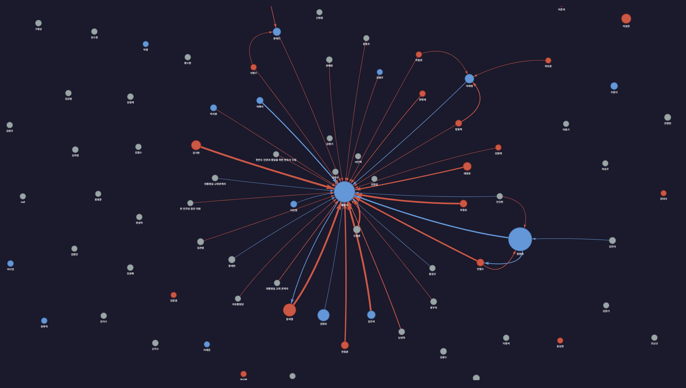
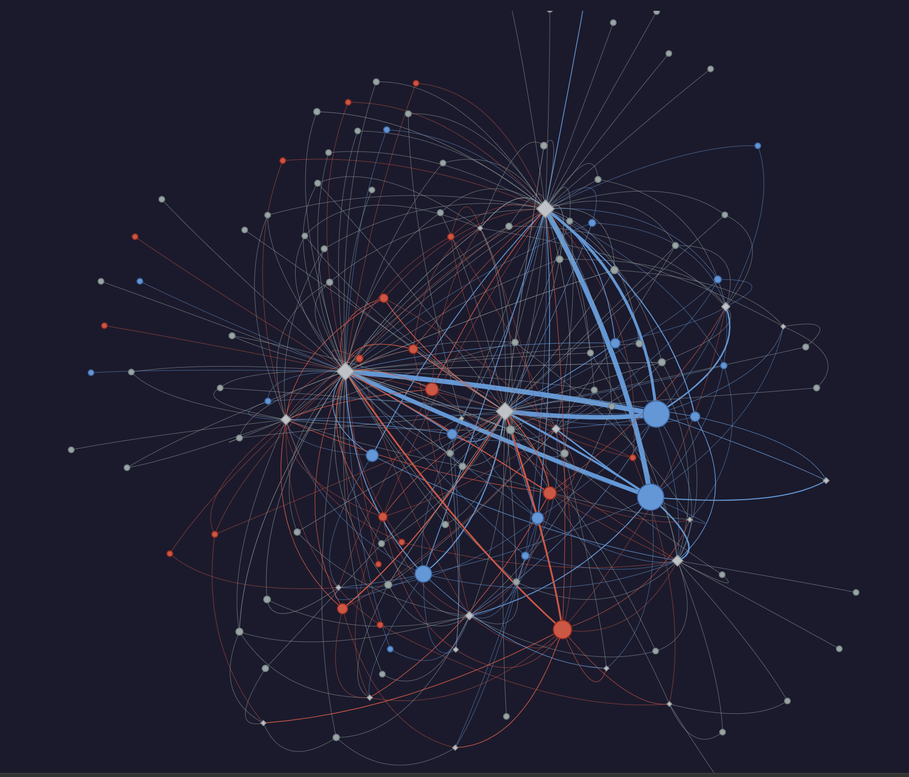
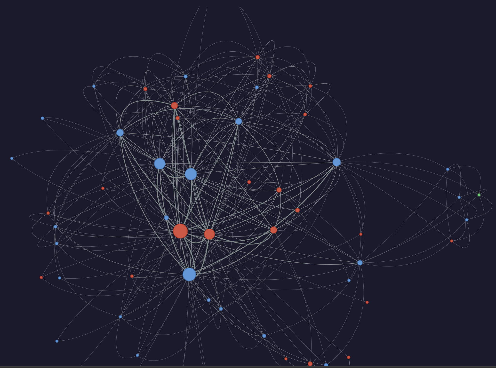

# 🇰🇷 한국 정치 담론 사회연결망 분석
### 2국가론 논쟁을 통해 본 한국 공론장의 구조

> **"독일과 같은 헌법 체계를 빌려왔는데, 왜 한국의 공론장은 다르게 작동하는가?"**

BigKinds 뉴스 데이터 · GPT-4o-mini 발언 분류 · NetworkX/Pyvis 시각화를 결합한 정치 담론 분석 파이프라인

---

## 📌 연구 배경 및 문제 정의

한국의 헌법은 독일 바이마르 공화국의 헌법 체계를 상당 부분 참조해 만들어졌다. 그런데 두 나라는 전혀 다른 결과를 낳았다.

독일은 분단 이후 하버마스(Jürgen Habermas)의 **헌법애국주의(Verfassungspatriotismus)** 를 토대로 건강한 공론장을 형성했다. 민족 감정이 아니라 민주적 헌법 가치에 대한 공유된 헌신으로 통일의 정당성을 구성한 것이다. 하버마스는 단순한 이론가가 아니라 통일 논의의 직접적 참여자였고, 동·서독 시민사회는 논증적 토론을 통해 통일 이후의 사회 통합을 이뤄냈다.

**왜 한국은 달랐는가.**

한국 헌법 제3조 — *"대한민국의 영토는 한반도와 그 부속도서로 한다"* — 의 맥락을 이해하려면 1948년으로 돌아가야 한다. 당시 소련과 중국이 북한을 배후에서 지원하고 있었고, 한반도 전체가 공산 진영에 넘어갈 수 있다는 현실적 위기가 존재했다. 이 조항은 그 위기에 대한 전략적 응답이었다. 북한을 국가로 인정하지 않음으로써, 유사시 북한 정권이 붕괴했을 때 한반도 전체에 대한 법적 정당성을 대한민국이 주장할 수 있는 근거를 헌법에 남겨둔 것이다. 현재도 중국은 북한에 대한 영향력을 유지하고 있으며, 북한 붕괴 시 중국·러시아가 영토적 정당성을 주장할 가능성이 있다. 헌법 3조와 4조(평화통일 조항)를 조화롭게 해석하면 사실상 무력통일은 불가하되, 유사시 붕괴 국면에서 대한민국이 한반도 전체에 대한 국제법적 정당성을 가질 수 있다는 것이다.

이 맥락에서 2국가론의 위험성이 드러난다. 2국가론을 국가 기조로 삼고 헌법 3조를 삭제할 경우, 북한 붕괴 시 대한민국이 한반도 전체에 대한 정당성을 주장할 법적 근거가 사라진다. **2국가론 자체가 틀렸다는 것이 이 연구의 전제가 아니다.** 문제는, 이 의제가 공론장에서 논증적으로 토론되지 못하고 있다는 것이다.

2024년 임종석 전 대통령 비서실장이 "한반도 두 국가론"을 공개 제안하자, 토론 준비 과정에서 관련 기사를 직접 탐색했다. **2국가론을 논증적으로 토론하는 공론장 기사는 단 한 건도 발견할 수 없었다.** 대부분의 반응은 "위헌", "반헌법", "종북" 프레임으로 의제 자체를 봉쇄하고 있었다. 독일이 분단과 통일이라는 민감한 의제를 공론장에서 논증적으로 다뤘던 것과 대조적이었다.

이 직관적 관찰을 실증적으로 검증하기 위해 이 연구를 시작했다. 한국의 2국가론 담론은 하버마스적 논증 교환인가, 아니면 진영 간 공격으로 채워진 담론인가.

이 프로젝트의 출발점은 2국가론에 대한 찬반을 판단하는 것이 아니다. 민감한 정치 의제가 한국 공론장에서 어떤 방식으로 처리되는지를 묻는 데 있다. 개별 정치인의 발언을 개인 의견으로만 보지 않고, 그것이 어떤 진영 관계·역사적 맥락·제도적 조건 속에서 반복되는지를 분석하고자 했다. 따라서 본 연구는 사회학적 문제의식을 바탕으로 인문사회 이론을 데이터 분석 가능한 지표로 조작화하고, 뉴스 담론의 구조를 실증적으로 확인하려는 시도이다.

---

## 🧩 핵심 개념 정의

### 하버마스의 공론장 조건
하버마스는 민주주의가 실질적으로 작동하려면 세 가지 조건을 갖춘 공론장이 필요하다고 주장했다.

| 조건 | 내용 |
|------|------|
| **접근의 개방성** | 누구나 담론에 참여할 수 있어야 한다 |
| **논증적 교환** | 권력이나 지위가 아닌, 논거의 힘으로만 설득해야 한다 |
| **권력으로부터의 자유** | 국가나 자본의 영향 없이 자유롭게 토론할 수 있어야 한다 |

### 발언 유형 분류 기준

| 유형 | 정의 |
|------|------|
| **논증형** | 근거·데이터·정책 대안을 제시하며 주장하는 발언 |
| **진영공격형** | 상대 진영을 비난하거나 이념적으로 의심하게 만드는 발언 (예: "종북", "위헌", "반국가세력" 프레이밍) |
| **단순언급형** | 사실 전달 또는 단순 입장 표명에 그치는 발언 |

### 이념 분류 기준

| 이념 | 해당 정당 |
|------|-----------|
| **보수** | 국민의힘, 개혁신당 |
| **진보** | 더불어민주당, 조국혁신당, 진보당, 정의당 |
| **기타** | 새미래민주당, 자유통일당, 무소속 등 명확히 분류하기 어려운 경우 |

22대 국회의원 299명 + 전·현직 주요 정치인 15명, 총 314명을 기준으로 분류했다.

---

## ❓ 연구 질문

하버마스의 공론장 세 조건은 규범적 이론이지, 곧바로 데이터를 집어넣을 수 있는 형식이 아니다. 이 연구에서는 이를 세 가지 측정 가능한 변수로 조작화했다.

- **논증적 교환** → GPT-4o-mini를 활용해 각 발언을 논증형 / 진영공격형 / 단순언급형으로 분류. 공론장이 작동한다면 논증형 비율이 높아야 한다.
- **네트워크 위상** → 발언자→발언 대상의 방향 그래프(DiGraph)를 구성해 중심성을 계산. 수평 교환(mesh)이면 공론장이고, 소수 집중(star)이면 공론장 실패를 의미한다.
- **의미 프레임** → 이념 진영별 키워드 빈도 분포를 통해 보수와 진보가 어떤 언어 프레임으로 의제에 대응했는지 확인한다.

이 세 변수가 하나의 연구 파이프라인 안에서 서로 다른 각도로 동일한 질문에 수렴한다는 점이 이 분석의 구조적 특징이다.

1. 2국가론 담론에서 논증형 vs 진영공격형 발언의 비율은 어떠한가? 이념 진영별로 차이가 존재하는가?
2. 발언 네트워크의 구조는 하버마스적 수평 교환인가, 특정 행위자에 집중된 비대칭 구조인가?
3. 보수와 진보는 어떤 키워드 프레임으로 2국가론 의제에 대응했는가?

---

## 🔬 가설

| 가설 | 내용 |
|------|------|
| **H1** | 진영 간 교차 논증 — 보수가 진보에게, 진보가 보수에게 논증형으로 응답하는 경우 — 은 전체 발언 중 극소수에 불과할 것이다 |
| **H2** | 발언 네트워크는 수평적 그물 구조가 아니라, 소수 행위자에 집중된 스타(star) 구조를 보일 것이다 |
| **H3** | 보수 진영은 의제를 봉쇄하는 프레임("반헌법", "위헌")을, 진보 진영은 의제를 여는 프레임("평화", "대북정책")을 주로 사용할 것이다 |

---

## 🔄 분석 파이프라인

```
📰 BigKinds 엑셀 (2국가론 검색, 559건)
    ↓
[02_from_bigkinds.py]
    ├─ 날짜 필터 (2024.01 ~ 2026.06)
    ├─ 정치인 등장 기사 사전 필터 (314명 기준)
    └─ 언론사 URL 본문 크롤링
    ↓
📄 articles_with_text_all.json (267건)
    ↓
[03b_analyze_all.py]
    ├─ GPT-4o-mini 발언 추출
    ├─ 담론 유형 분류 (논증형 / 진영공격형 / 단순언급형)
    ├─ 이념 판단 (보수 / 진보 / 중도 / 기타)
    └─ 발언 대상(target) 및 키워드 추출
    ↓
💬 utterances_all.json (643개 발언)
    ↓
[04_build_network.py]
    ├─ 그래프 1: 정치인→정치인 방향 발언 네트워크
    ├─ 그래프 2: 정치인-키워드 이분 네트워크
    └─ 그래프 3: 정치인-정치인 공동등장 네트워크
    ↓
🌐 output/ (HTML 인터랙티브 시각화)
```

---

## 📊 분석 결과

### 데이터 개요

| 항목 | 수치 |
|------|------|
| 수집 기사 | 267건 |
| 추출 발언 | 622개 |
| 분석 정치인 | 121명 |
| 수집 기간 | 2024.01 ~ 2026.06 |
| 담론 폭발 시점 | 2024년 9월 (88건) |

### 담론 유형 분포

| 유형 | 전체 | 보수 (166개) | 진보 (341개) |
|------|------|------|------|
| 논증형 | 41.6% (259개) | 27.1% (45개) | 47.8% (163개) |
| 진영공격형 | 19.3% (120개) | **50.0% (83개)** | 7.6% (26개) |
| 단순언급형 | 38.6% (240개) | 22.9% (38개) | 44.0% (150개) |

### 진영 간 교차 발언

| 방향 | 총 발언 | 논증형 | 진영공격형 |
|------|---------|--------|-----------|
| 보수 → 진보 | 73개 | 8개 (11%) | **65개 (89%)** |
| 진보 → 보수 | 7개 | 5개 (71%) | 1개 (14%) |

### 주요 발언자 (상위 5명)

| 순위 | 정치인 | 이념 | 발언 수 |
|------|--------|------|---------|
| 1 | 정동영 | 진보 | 92개 |
| 2 | 임종석 | 진보 | 79개 |
| 3 | 윤석열 | 보수 | 37개 |
| 4 | 김영호 | 진보 | 32개 |
| 5 | 이성권 | 보수 | 21개 |

### 임종석 타겟 발언

| 항목 | 수치 |
|------|------|
| 타겟 발언 총계 | 107개 |
| 진영공격형 | 77개 (72%) |
| 논증형 | 24개 (22%) |
| 보수 발언자 | 62개 |
| **진보 발언자** | **40개** |

---

## 🗺️ 네트워크 시각화

### Graph 1 — 정치인→정치인 방향 발언 네트워크

> 노드 색: 🔵 진보 · 🔴 보수 · ⚪ 기타 / 엣지 색: 🔵 논증형 · 🔴 진영공격형 / 엣지 방향: 발언자 → 타깃 / 노드 크기: 발언 수 비례



**📎 [인터랙티브 그래프 열기 →](https://nobaggu.github.io/korean-political-discourse-sna/output/graph1_directed.html)**

임종석 노드 하나에 빨간 화살표가 집중되는 **스타(star) 구조**가 시각적으로 드러난다. 임종석을 타겟으로 한 발언 107개 중 공격형이 77개(72%). 보수→진보 교차 발언 73개 대 진보→보수 7개로 극도로 비대칭적이다.

---

### Graph 2 — 정치인-키워드 이분 네트워크 (Bipartite Network)

> 노드 형태: ● 정치인 · ◆ 키워드(다이아몬드) / 엣지 색: 발언자 이념색 / 엣지 굵기: 연결 빈도 비례



**📎 [인터랙티브 그래프 열기 →](https://nobaggu.github.io/korean-political-discourse-sna/output/graph2_bipartite.html)**

진보 정치인이 "남북관계(157회)", "2국가론(163회)", "통일(129회)", "평화(26회)"로 다양한 정책 키워드를 다룬 반면, 보수는 "북한(34회)"·**"헌법(12회)"** 으로 안보·합헌성 프레임에 집중했다. 담론의 프레이밍 전쟁이 구조적으로 드러난다.

---

### Graph 3 — 정치인-정치인 공동등장 네트워크 (Co-occurrence)

> 노드 색: 🔵 진보 · 🔴 보수 · ⚪ 기타 / 엣지: 무방향 회색선 / 엣지 굵기: 공동등장 기사 수 비례



**📎 [인터랙티브 그래프 열기 →](https://nobaggu.github.io/korean-political-discourse-sna/output/graph3_cooccurrence.html)**

공동등장 1위 문재인↔임종석(60건), 윤석열↔이재명(55건). 그래프 1과 비교하면 핵심이 드러난다 — **같은 기사에 함께 언급은 많이 되지만, 실제 논증적 교환은 거의 없다.**

---

## 💡 사회학적 해석

### H1 — 지지됨 (단, 비대칭적 방식으로)
H1은 교차 논증이 극소수일 것이라 예측했다. 결과는 예측보다 더 극단적이었다. 보수→진보 교차 발언 73개 중 89%(65개)가 공격형이었고, 논증형은 8개(11%)에 불과했다. 반대 방향인 진보→보수는 총 7개로, 보수→진보의 10분의 1 수준이었다. 하버마스적 공론장이라면 상대 진영의 주장에 논거로 응답해야 하지만, 한국의 2국가론 담론에서 교차 발언의 주된 형태는 논증이 아닌 공격이었다.

### H2 — 지지됨
임종석을 타겟으로 한 발언이 107개로, 그 중 72%(77개)가 공격형이었다. 더 흥미로운 것은 이 공격의 40개가 **진보 발언자**에서 나왔다는 점이다. 2국가론이 이념 갈등을 넘어 진보 내부 분열까지 촉발했으며, 공론장의 균열이 진영이 아니라 의제를 중심으로 재편됐다는 것을 보여준다. 스타 구조는 단순한 진영 대결이 아니라 하나의 발언자가 담론 전체의 표적이 되는 구조였다.

### H3 — 지지됨
보수 상위 키워드: 2국가론(83), 통일(72), **북한(34), 헌법(12)**
진보 상위 키워드: 2국가론(163), **남북관계(157)**, 통일(129), **대북정책(43), 평화(26)**

키워드 목록은 겹쳐 보이지만 프레이밍이 다르다. 보수는 "헌법"·"북한"으로 의제를 위협으로 프레이밍했고, 진보는 "평화"·"대북정책"으로 의제를 정책 선택지로 프레이밍했다. 하버마스가 구분한 **의사소통 행위(communicative action)** vs **전략적 행위(strategic action)** 의 차이가 키워드 분포 수준에서 드러난다.

### 종합
2국가론 담론은 공론장의 외형 — 다양한 행위자, 622개 발언, 진영 간 교차 언급 — 은 갖췄다. 그러나 내용은 논증적 교환보다 일방적 프레이밍과 인물 공격으로 채워졌다. 보수 발언자의 절반이 공격형이었고, 교차 발언 89%가 논증 없는 공격이었다. 독일이 헌법애국주의를 통해 민감한 통일 의제를 공론화했던 것과 달리, 한국에서는 2국가론이라는 의제가 논증의 대상이 아닌 공격의 표적이 됐다. **같은 헌법 체계를 출발점으로 삼았지만, 냉전의 역사적 맥락이 달랐고, 그 결과 공론장의 질도 달라졌다.**

---

## 📁 폴더 구조

```
korean-political-discourse-sna/
├── 📂 data/
│   ├── assembly_members.json             # 314명 정치인 이념·정당 데이터
│   ├── raw/
│   │   └── articles_with_text_all.json   # 크롤링 기사 (267건)
│   └── processed/
│       └── utterances_all.json           # GPT 분류 발언 (622개)
│
├── 📂 output/
│   ├── graph1_directed.html              # 방향 발언 네트워크
│   ├── graph2_bipartite.html             # 정치인-키워드 이분 네트워크
│   └── graph3_cooccurrence.html          # 공동등장 네트워크
│
├── 📂 이미지/
│   ├── graph1.png
│   ├── graph2.png
│   └── graph3.png
│
├── 02_from_bigkinds.py                   # BigKinds 엑셀 → 본문 크롤링
├── 03b_analyze_all.py                    # GPT-4o-mini 발언 추출·분류
├── 04_build_network.py                   # NetworkX·Pyvis 네트워크 생성
├── config.py                             # API 키 설정 (git 제외)
├── requirements.txt
└── README.md
```

---

## ⚙️ 실행 방법

### 환경 설정
```bash
pip install -r requirements.txt
```

`config.py` 에 API 키 입력:
```python
OPENAI_API_KEY = "your-openai-api-key"
```

### 파이프라인 실행

**Step 1 — BigKinds 엑셀 크롤링**
```bash
python 02_from_bigkinds.py data/raw/NewsResult_20240608-20260618.xlsx
```

**Step 2 — GPT 발언 추출 및 분류**
```bash
python 03b_analyze_all.py
```

**Step 3 — 네트워크 생성 및 시각화**
```bash
python 04_build_network.py
```

생성된 `output/*.html` 파일을 브라우저에서 열면 인터랙티브 네트워크를 확인할 수 있다.

---

## 🛠️ 기술 스택

| 분류 | 도구 |
|------|------|
| 데이터 수집 | BigKinds, BeautifulSoup, requests |
| 발언 분류 | GPT-4o-mini (OpenAI API) |
| 네트워크 분석 | NetworkX |
| 시각화 | Pyvis |
| 언어 | Python 3.11 |

---

## 📚 이론적 배경

- Habermas, J. (1962). *Strukturwandel der Öffentlichkeit* (공론장의 구조변동)
- Habermas, J. (1990). *Die nachholende Revolution* (헌법애국주의와 독일 통일)
- 한국 헌법 제3조 (영토 조항) · 제4조 (평화통일 조항)

---

작성일: 2026-06-19
